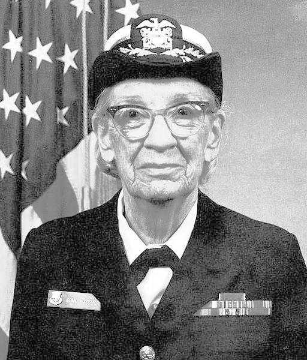

# Advanced Programming Group Project - Tarjan
Advanced Programming course group project assessment

## Summary

This repository contains a range of image filters and orthographic projections that can be applied to an input 2D or 3D data volume. All codes are written in C++ from scratch. Available operations are:

### 2D Filters

* Colour Correction - Grayscale, Automatic Colour Balance, Brightness, Histogram Equalization
* Image Blur - Median blur, Box blur, Gaussian blur
	
* Edge Detection - Sobel, Prewitt, Scharr

### 3D Filters and Projections
* Gaussian filter
* Median filter

* Orthographic Projections - Maximum intensity projection (MIP), Minimum intensity projection (MinIP), Average intensity projection (AIP)

### 3D Slicing

* Slice a volume along the x-axis
* Slice a volume along the y-axis

## Usage

### Datasets

2D image files are availale in [Images](https://github.com/ese-msc-2022/advanced-programming-group-tarjan/tree/main/Images).

CT Scan datasets for 3D Volumes are available [here](https://imperiallondon-my.sharepoint.com/:u:/g/personal/tmd02_ic_ac_uk/EafXMuNsbcNGnRpa8K62FjkBvIKvCswl1riz7hPDHpHdSQ).

### Compilation

* Clone the repository to the platform: `git clone`
* From the command line, enter the source directory: `cd src`
* Compile the project: `make`
* Make sure to remove all the compiled object files from the source code each time: `make clean`

### Help

Run with flag `--help` to print possible command line arguments. E.g. `./main --help`.   

### Deployment

* From the command line, run the program in the format: 

 	`./main --[input type (either image or volume)] [input file path] --[filter name] [filter options]`.
* User could apply as many filters as desired at the same time.
* When applying certain filters, the argument `[filter options]` must be included:
  * For example, to run using a 2D Gaussian filter of size 5x5, pass the kernel size:
  
  	`./main --image [input file path] --gaussian 5`.
  * These are also explained in `--help`.
  
 ### Tests
 
 * Run `./main --test` to run tests.
 
 
 
### Example

#### Applying filters to an image

Executing
`./main --image ../Images/gracehopper.png --grayscale --histogram`
in the command line results in the following:

Input             |  Output
:----------------:|:---------------:
  |  

#### Applying 3D filter and projection a volume

Executing
`./main --volume ../Scans/fracture --gaussian_blur 5 --mip`

### Outputs

There is no need for user to parse in the output file name/path; main.cpp will automatically save the generated output in the corresponding folder in [Output](https://github.com/ese-msc-2022/advanced-programming-group-tarjan/tree/main/Output) and the file will be named as all the operations applied to the input image.

For example, the command `./main --image [../Images/gracehopper.png] --grayscale --histogram` saves `grayscale_histogram.png` in the [gracehopper](https://github.com/ese-msc-2022/advanced-programming-group-tarjan/tree/main/Output/gracehopper) folder.

## Structure

```
folders:
	Images			- Input 2D images
	Output			- Output images
	src			- Project source and header files (h/cpp)
	
files:
	LICENCE.txt		- License file
	README.md		- This readme file
```

[src/filter](https://github.com/ese-msc-2022/advanced-programming-group-tarjan/tree/main/src/filter) contains all the filters and operations.

##
